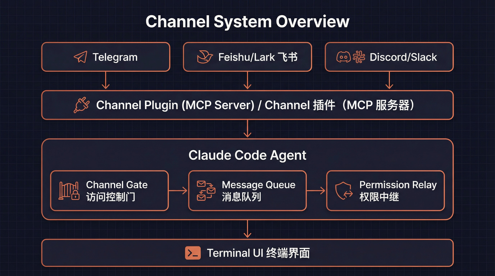
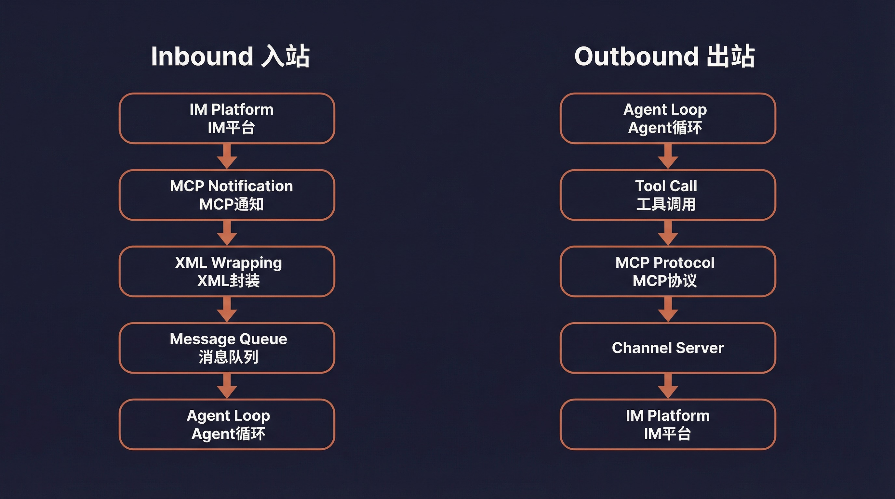
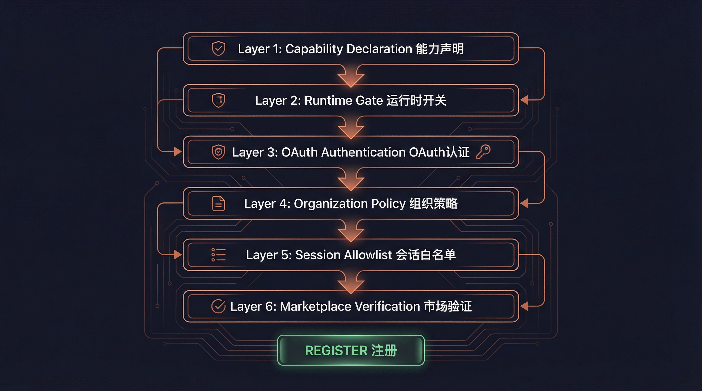
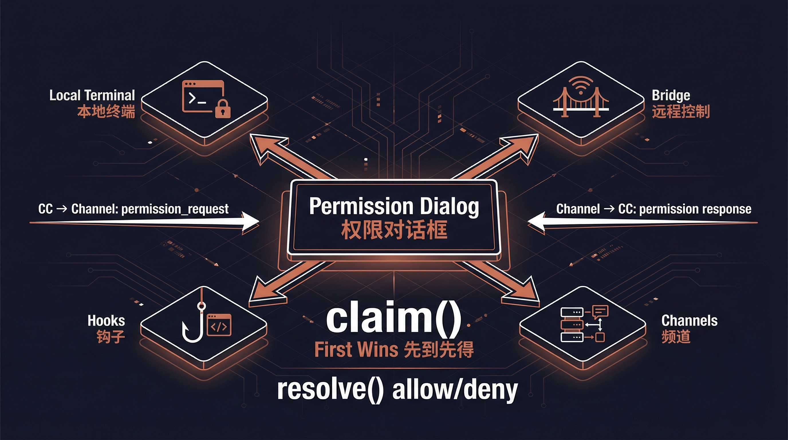

# Channel 系统架构解析

> 从源码视角深度剖析 Claude Code 如何通过 IM 平台远程控制 Agent

<p align="center">
<a href="#一什么是-channel">概念</a> ·
<a href="#二整体架构">架构</a> ·
<a href="#三消息协议">协议</a> ·
<a href="#四六层访问控制">访问控制</a> ·
<a href="#五权限中继系统">权限中继</a> ·
<a href="#六ui-组件">UI</a> ·
<a href="#七插件-channel-架构">插件</a> ·
<a href="#八安全设计">安全</a> ·
<a href="#九命令行接口">CLI</a> ·
<a href="#十特性开关与分析">特性开关</a>
</p>



---

## 一、什么是 Channel

Channel 是 Claude Code 的 **IM 集成系统**，它允许用户通过 Telegram、Feishu（飞书）、Discord、Slack 等即时通讯平台远程控制正在运行的 Claude Code Agent。

### 核心理念

传统的 AI 编程助手只能在终端中交互。Channel 系统打破了这一限制——你可以在手机上通过 Telegram 给 Claude Code 发消息，它会像在终端中一样理解并执行你的请求，并将结果回复到你的聊天窗口。

### Channel 的本质

从技术角度看，一个 Channel 就是一个特殊的 **MCP（Model Context Protocol）Server**，它需要：

1. **声明能力**：在 MCP 握手时声明 `experimental['claude/channel']` 能力
2. **推送消息**：通过 `notifications/claude/channel` 通知将 IM 消息推入 Agent 对话
3. **暴露工具**：提供 `reply`、`react`、`edit_message` 等 MCP 工具，让 Agent 回复到 IM 平台

```typescript
// Channel 的两种形态
type ChannelEntry =
  | { kind: 'plugin'; name: string; marketplace: string; dev?: boolean }
  | { kind: 'server'; name: string; dev?: boolean }
```

**plugin 类型**：来自 marketplace 的验证插件（如 `plugin:telegram@anthropic`）
**server 类型**：直接指定的 MCP 服务器名称（始终需要 dev 旁路）

---

## 二、整体架构



### 消息流转全链路

Channel 系统的消息流转遵循一个清晰的双向路径：

```
┌─────────────────────────────────────────────────────────────┐
│                    入站（IM → Agent）                        │
│                                                             │
│  Telegram/Feishu/Discord                                    │
│       ↓                                                     │
│  Channel Plugin（MCP Server）                               │
│       ↓                                                     │
│  notifications/claude/channel { content, meta }             │
│       ↓                                                     │
│  useManageMCPConnections → registerNotificationHandler      │
│       ↓                                                     │
│  wrapChannelMessage() → <channel source="..." user="...">  │
│       ↓                                                     │
│  enqueue({ priority: 'next', isMeta: true })                │
│       ↓                                                     │
│  SleepTool 每 ~1s 轮询 hasCommandsInQueue()                │
│       ↓                                                     │
│  Model 看到 <channel> 标签，理解消息来源                      │
└─────────────────────────────────────────────────────────────┘

┌─────────────────────────────────────────────────────────────┐
│                    出站（Agent → IM）                        │
│                                                             │
│  Model 决定使用哪个工具回复                                   │
│       ↓                                                     │
│  callTool() → Channel 的 MCP 工具                           │
│  （reply / react / edit_message / download_attachment）      │
│       ↓                                                     │
│  MCP 协议调用 Channel Server                                │
│       ↓                                                     │
│  Channel Server 发送消息到 IM 平台                           │
│       ↓                                                     │
│  Telegram/Feishu/Discord 用户收到回复                        │
└─────────────────────────────────────────────────────────────┘
```

### 核心组件关系

| 组件 | 文件 | 职责 |
|------|------|------|
| **Channel Gate** | `channelNotification.ts` | 六层访问控制门 |
| **Message Wrapper** | `channelNotification.ts` | XML 消息封装 |
| **Permission Relay** | `channelPermissions.ts` | 远程权限审批 |
| **Allowlist** | `channelAllowlist.ts` | GrowthBook 白名单管理 |
| **MCP Connection** | `useManageMCPConnections.ts` | 连接管理与通知注册 |
| **Channel Message UI** | `UserChannelMessage.tsx` | 终端渲染 Channel 消息 |
| **Dev Dialog** | `DevChannelsDialog.tsx` | 开发模式确认对话框 |
| **Channels Notice** | `ChannelsNotice.tsx` | 启动时 Channel 状态通知 |
| **Plugin Integration** | `mcpPluginIntegration.ts` | 插件作用域命名 |
| **State** | `bootstrap/state.ts` | 全局 Channel 白名单状态 |

---

## 三、消息协议

### 3.1 入站通知 Schema

Channel Server 推送到 Claude Code 的通知格式：

```typescript
// channelNotification.ts
const ChannelMessageNotificationSchema = z.object({
  method: z.literal('notifications/claude/channel'),
  params: z.object({
    content: z.string(),
    // 透传元数据 — thread_id、user 等
    // 渲染为 <channel> 标签的属性
    meta: z.record(z.string(), z.string()).optional(),
  }),
})
```

### 3.2 XML 封装

收到通知后，系统将其封装为 `<channel>` XML 标签：

```typescript
// channelNotification.ts:106-116
function wrapChannelMessage(
  serverName: string,
  content: string,
  meta?: Record<string, string>,
): string {
  const attrs = Object.entries(meta ?? {})
    .filter(([k]) => SAFE_META_KEY.test(k))  // 防 XML 注入
    .map(([k, v]) => ` ${k}="${escapeXmlAttr(v)}"`)
    .join('')
  return `<channel source="${escapeXmlAttr(serverName)}"${attrs}>
${content}
</channel>`
}
```

**封装结果示例**：
```xml
<channel source="plugin:telegram:tg" user="alice" chat_id="123456">
帮我看看 main.ts 有什么问题
</channel>
```

Model 看到这个标签后，就知道消息来自 Telegram 的用户 alice，并会使用 Telegram 的 `reply` 工具回复。

### 3.3 安全的元数据过滤

Meta 键名会成为 XML 属性名，恶意构造的键（如 `x="" injected="y`）可能导致 XML 注入。系统使用严格的正则过滤：

```typescript
// 只允许纯标识符格式的键名
const SAFE_META_KEY = /^[a-zA-Z_][a-zA-Z0-9_]*$/
```

实际场景中，Channel 服务器只发送 `chat_id`、`user`、`thread_ts`、`message_id` 这类安全键名。

### 3.4 消息入队

封装后的消息通过 enqueue 推入消息队列：

```typescript
enqueue({
  mode: 'prompt',
  value: wrapChannelMessage(serverName, content, meta),
  priority: 'next',        // 高优先级
  isMeta: true,             // 元数据消息
  origin: { kind: 'channel', server: serverName },
  skipSlashCommands: true   // 不解释为斜杠命令
})
```

SleepTool 每约 1 秒轮询一次 `hasCommandsInQueue()`，发现新消息后唤醒 Agent。

---

## 四、六层访问控制



Channel 系统采用**六层递进式访问控制**，每一层都可以独立阻断 Channel 注册。这是整个系统安全性的基石。

### Gate 函数签名

```typescript
// channelNotification.ts:191-316
function gateChannelServer(
  serverName: string,
  capabilities: ServerCapabilities | undefined,
  pluginSource: string | undefined,
): ChannelGateResult  // { action: 'register' } | { action: 'skip', kind, reason }
```

### 4.1 第一层：能力声明（Capability）

```typescript
if (!capabilities?.experimental?.['claude/channel']) {
  return { action: 'skip', kind: 'capability',
    reason: 'server did not declare claude/channel capability' }
}
```

MCP Server 必须在握手时声明 `experimental['claude/channel']: {}` 能力。这是 MCP 的"存在信号"惯例（类似 `tools: {}`），将普通 MCP Server 与 Channel Server 区分开来。

### 4.2 第二层：运行时开关（Runtime Gate）

```typescript
if (!isChannelsEnabled()) {
  return { action: 'skip', kind: 'disabled',
    reason: 'channels feature is not currently available' }
}
```

`isChannelsEnabled()` 检查 GrowthBook 特性开关 `tengu_harbor`（默认 false，5 分钟刷新）。这是全局的"紧急制动"——关闭此开关立即禁用所有 Channel，不需要发版。

### 4.3 第三层：OAuth 认证（Auth）

```typescript
if (!getClaudeAIOAuthTokens()?.accessToken) {
  return { action: 'skip', kind: 'auth',
    reason: 'channels requires claude.ai authentication (run /login)' }
}
```

Channel 仅限 OAuth 认证用户。API Key 用户被阻止，因为 Console 端目前还没有 `channelsEnabled` 的管理界面。

### 4.4 第四层：组织策略（Policy）

```typescript
const sub = getSubscriptionType()
const managed = sub === 'team' || sub === 'enterprise'
const policy = managed ? getSettingsForSource('policySettings') : undefined
if (managed && policy?.channelsEnabled !== true) {
  return { action: 'skip', kind: 'policy',
    reason: 'channels not enabled by org policy' }
}
```

Teams/Enterprise 组织必须在托管设置中显式启用 `channelsEnabled: true`。默认关闭——即使没有配置任何策略的团队组织也不会回退到非托管路径。

### 4.5 第五层：会话白名单（Session）

```typescript
const entry = findChannelEntry(serverName, getAllowedChannels())
if (!entry) {
  return { action: 'skip', kind: 'session',
    reason: `server ${serverName} not in --channels list for this session` }
}
```

MCP Server 必须在本次会话的 `--channels` 参数列表中。即使一个受信任的 Server 动态添加了 `claude/channel` 能力，也无法绕过——必须用户在启动时显式列出。

### 4.6 第六层：Marketplace 验证 + 白名单（Allowlist）

对于 plugin 类型的 Channel：

```typescript
// Marketplace 验证：确保安装的插件来自声称的市场
const actual = pluginSource
  ? parsePluginIdentifier(pluginSource).marketplace
  : undefined
if (actual !== entry.marketplace) {
  return { action: 'skip', kind: 'marketplace',
    reason: `tag mismatch: asked for @${entry.marketplace}, installed from ${actual}` }
}

// 白名单检查：插件必须在 GrowthBook 审批列表中
if (!entry.dev) {
  const { entries } = getEffectiveChannelAllowlist(sub, policy?.allowedChannelPlugins)
  if (!entries.some(e => e.plugin === entry.name && e.marketplace === entry.marketplace)) {
    return { action: 'skip', kind: 'allowlist', reason: 'not on approved list' }
  }
}
```

**双重验证**：先验证 `--channels plugin:slack@anthropic` 中的 `@anthropic` 标签与实际安装的插件来源是否匹配（防止 `slack@evil` 冒充 `slack@anthropic`），再检查是否在审批白名单中。

**白名单来源优先级**：Team/Enterprise 组织可以设置 `allowedChannelPlugins`，此时它替代 GrowthBook ledger 白名单（管理员拥有信任决策权）。

对于 server 类型，白名单始终失败（schema 是 `{marketplace, plugin}` 格式，server 类型无法匹配），除非使用 `--dangerously-load-development-channels`（设置 `entry.dev = true` 旁路白名单）。

### Gate 结果类型

```typescript
type ChannelGateResult =
  | { action: 'register' }           // 通过所有检查，注册通知处理器
  | { action: 'skip'; kind: string; reason: string }  // 某层拦截

// kind 枚举：capability | disabled | auth | policy | session | marketplace | allowlist
```

---

## 五、权限中继系统



### 5.1 为什么需要权限中继

当 Claude Code 需要执行敏感操作（如运行 Bash 命令），会弹出权限确认对话框。但如果用户通过 Telegram 远程控制 Agent，他看不到本地终端的对话框。

权限中继系统解决了这个问题：**将权限提示转发到 IM 平台，让用户在手机上也能审批或拒绝操作**。

### 5.2 出站：CC → Channel（权限请求）

当 Agent 触发权限对话框且 Channel 声明了 `experimental['claude/channel/permission']` 能力时：

```typescript
// 通知 Schema
const CHANNEL_PERMISSION_REQUEST_METHOD =
  'notifications/claude/channel/permission_request'

type ChannelPermissionRequestParams = {
  request_id: string      // 5 字母标识符（如 "tbxkq"）
  tool_name: string       // 工具名（如 "Bash"）
  description: string     // 人类可读描述
  input_preview: string   // JSON 输入预览，截断到 200 字符
}
```

Channel Server 收到后，按各平台格式化（Telegram markdown、Discord embed 等）发送给用户。

### 5.3 Short Request ID 生成

5 字母标识符的设计充满巧思：

```typescript
// channelPermissions.ts:140-152
function shortRequestId(toolUseID: string): string {
  let candidate = hashToId(toolUseID)
  for (let salt = 0; salt < 10; salt++) {
    if (!ID_AVOID_SUBSTRINGS.some(bad => candidate.includes(bad))) {
      return candidate
    }
    candidate = hashToId(`${toolUseID}:${salt}`)
  }
  return candidate
}
```

**设计决策**：
- **25 字母表**：a-z 去掉 `l`（与 1/I 混淆），25^5 约 980 万种组合
- **FNV-1a 哈希**：不是加密级别，但足够稳定且快速
- **脏话过滤**：5 个随机字母可能拼出不雅词汇（如发短信给老板的场景），内置屏蔽词表
- **纯字母**：手机用户不需要切换键盘模式（十六进制需要在字母和数字间切换）
- **大小写不敏感**：适配手机自动更正

### 5.4 入站：Channel → CC（权限响应）

用户在 IM 中回复格式：`yes tbxkq` 或 `no tbxkq`

```typescript
// 服务端解析正则
const PERMISSION_REPLY_RE = /^\s*(y|yes|n|no)\s+([a-km-z]{5})\s*$/i

// 结构化通知（服务端解析后发出，而非 CC 端正则匹配文本）
const ChannelPermissionNotificationSchema = z.object({
  method: z.literal('notifications/claude/channel/permission'),
  params: z.object({
    request_id: z.string(),
    behavior: z.enum(['allow', 'deny']),
  }),
})
```

**关键设计**：Channel Server 负责解析用户回复并发出结构化事件，CC 端不做文本正则匹配。这意味着普通聊天中的文字永远不会意外触发权限审批。

### 5.5 多源竞争

权限响应来自四个来源，先到先得：

```
┌──────────────┐   ┌──────────────┐   ┌──────────────┐   ┌──────────────┐
│   本地终端    │   │    Bridge    │   │   Channels   │   │    Hooks     │
│  Local UI    │   │   远程控制    │   │ Telegram etc │   │  Permission  │
└──────┬───────┘   └──────┬───────┘   └──────┬───────┘   └──────┬───────┘
       │                   │                   │                  │
       └───────────────────┴───────────────────┴──────────────────┘
                                    │
                              claim() — 先到先得
                                    │
                              ┌─────┴─────┐
                              │  resolve   │
                              │  allow/deny│
                              └───────────┘
```

`createChannelPermissionCallbacks()` 使用闭包维护 pending Map（不在模块级别，也不在 AppState 中——函数引用在状态中会导致序列化问题），构造一次后存入 AppState。

### 5.6 过滤权限中继客户端

```typescript
// channelPermissions.ts:177-194
function filterPermissionRelayClients(clients, isInAllowlist) {
  return clients.filter(c =>
    c.type === 'connected' &&
    isInAllowlist(c.name) &&
    c.capabilities?.experimental?.['claude/channel'] !== undefined &&
    c.capabilities?.experimental?.['claude/channel/permission'] !== undefined
  )
}
```

**三个条件全部必须**：已连接 + 在白名单中 + 同时声明了两个能力（`claude/channel` 和 `claude/channel/permission`）。第二个能力是显式 opt-in——只推消息的 Channel 永远不会意外成为权限审批入口。

---

## 六、UI 组件

### 6.1 终端消息渲染（UserChannelMessage）

```typescript
// UserChannelMessage.tsx
// 解析 <channel> XML 标签并在终端中渲染

const CHANNEL_RE = new RegExp(
  `<${CHANNEL_TAG}\\s+source="([^"]+)"([^>]*)>\\n?([\\s\\S]*?)\\n?</${CHANNEL_TAG}>`
)

// 插件服务器名称显示：plugin:slack-channel:slack → slack
function displayServerName(name: string): string {
  const i = name.lastIndexOf(':')
  return i === -1 ? name : name.slice(i + 1)
}

const TRUNCATE_AT = 60  // 消息体截断长度
```

**渲染效果**：
```
◁ tg · alice: 帮我看看 main.ts 有什么问题
```

其中 `◁` 是 Channel 箭头符号（`CHANNEL_ARROW`），显示服务器叶子名称和可选的用户名。

### 6.2 状态通知（ChannelsNotice）

启动时显示 `--channels` 条目的状态，报告阻断原因：

| 阻断类型 | 含义 |
|----------|------|
| `disabled` | Channel 功能未启用（tengu_harbor 关闭） |
| `noAuth` | 未通过 OAuth 认证 |
| `policyBlocked` | 组织策略未启用 channels |
| `unmatched` | 未在 `--channels` 列表中匹配到 |

### 6.3 开发者确认对话框（DevChannelsDialog）

使用 `--dangerously-load-development-channels` 时显示的警告对话框：

```
┌─ WARNING: Loading development channels ──────────────────┐
│                                                          │
│  --dangerously-load-development-channels is for local    │
│  channel development only. Do not use this option to     │
│  run channels you have downloaded off the internet.      │
│                                                          │
│  Please use --channels to run a list of approved channels│
│                                                          │
│  Channels: plugin:my-channel@local                       │
│                                                          │
│  > I am using this for local development                 │
│    Exit                                                  │
└──────────────────────────────────────────────────────────┘
```

选择 "Exit" 会调用 `gracefulShutdownSync(1)` 立即退出。

---

## 七、插件 Channel 架构

### 7.1 Plugin Manifest 中的 Channel 声明

插件通过 `plugin.json` 中的 `channels` 数组声明 Channel：

```typescript
// schemas.ts:670-703
const PluginManifestChannelsSchema = z.object({
  channels: z.array(z.object({
    server: z.string().min(1),       // MCP 服务器名，必须匹配 mcpServers 中的 key
    displayName: z.string().optional(),  // 配置对话框标题（如 "Telegram"）
    userConfig: z.record(             // 安装时提示用户配置的字段
      z.string(),
      PluginUserConfigOptionSchema()
    ).optional(),
  }).strict()),
})
```

**示例 plugin.json**：
```json
{
  "name": "telegram",
  "version": "1.0.0",
  "mcpServers": {
    "tg": {
      "command": "node",
      "args": ["./server.js"],
      "env": {
        "BOT_TOKEN": "${user_config.bot_token}",
        "OWNER_ID": "${user_config.owner_id}"
      }
    }
  },
  "channels": [
    {
      "server": "tg",
      "displayName": "Telegram",
      "userConfig": {
        "bot_token": {
          "type": "string",
          "description": "Telegram Bot API Token",
          "required": true,
          "secret": true
        },
        "owner_id": {
          "type": "string",
          "description": "Your Telegram User ID",
          "required": true
        }
      }
    }
  ]
}
```

### 7.2 配置流（PluginOptionsFlow）

启用插件后，如果 Channel 有未配置的 `userConfig` 字段：

1. `getUnconfiguredChannels()` 检测未满足验证的字段
2. `PluginOptionsFlow` 组件逐个提示用户输入
3. 敏感值（如 bot_token）存入 Keychain
4. 普通值存入 `~/.claude/plugins/options/{pluginId}.json`

```typescript
// mcpPluginIntegration.ts:290-318
function getUnconfiguredChannels(plugin: LoadedPlugin): UnconfiguredChannel[] {
  const channels = plugin.manifest.channels
  if (!channels || channels.length === 0) return []

  const unconfigured: UnconfiguredChannel[] = []
  for (const channel of channels) {
    if (!channel.userConfig) continue
    const saved = loadMcpServerUserConfig(pluginId, channel.server) ?? {}
    const validation = validateUserConfig(saved, channel.userConfig)
    if (!validation.valid) {
      unconfigured.push({
        server: channel.server,
        displayName: channel.displayName ?? channel.server,
        configSchema: channel.userConfig,
      })
    }
  }
  return unconfigured
}
```

### 7.3 作用域命名（Scoped Naming）

插件提供的 MCP Server 会被添加作用域前缀以避免冲突：

```typescript
// mcpPluginIntegration.ts:341-360
function addPluginScopeToServers(
  servers: Record<string, McpServerConfig>,
  pluginName: string,
  pluginSource: string,  // e.g., "telegram@anthropic"
): Record<string, ScopedMcpServerConfig> {
  const scopedServers = {}
  for (const [name, config] of Object.entries(servers)) {
    const scopedName = `plugin:${pluginName}:${name}`
    scopedServers[scopedName] = {
      ...config,
      scope: 'dynamic',
      pluginSource,
    }
  }
  return scopedServers
}
```

**命名转换**：
- 输入：`{ "tg": { ... } }` from `telegram@anthropic`
- 输出：`{ "plugin:telegram:tg": { scope: 'dynamic', pluginSource: 'telegram@anthropic', ... } }`

`pluginSource` 被保存在配置上，后续 Channel Gate 的 marketplace 验证步骤会用到它。

### 7.4 白名单有效来源

```typescript
// channelNotification.ts:127-138
function getEffectiveChannelAllowlist(sub, orgList) {
  // Team/Enterprise 组织自定义白名单 → 替代 GrowthBook ledger
  if ((sub === 'team' || sub === 'enterprise') && orgList) {
    return { entries: orgList, source: 'org' }
  }
  // 默认使用 GrowthBook ledger
  return { entries: getChannelAllowlist(), source: 'ledger' }
}
```

组织管理员可以通过 `allowedChannelPlugins` 完全控制哪些 Channel 插件被信任，而不依赖全局 ledger。

---

## 八、安全设计

### 8.1 XML 注入防护

Channel 消息中的元数据会成为 XML 属性。两道防线：

1. **键名过滤**：`SAFE_META_KEY = /^[a-zA-Z_][a-zA-Z0-9_]*$/` 只允许纯标识符
2. **值转义**：`escapeXmlAttr()` 对属性值进行 XML 转义

### 8.2 Marketplace 验证

`--channels plugin:slack@anthropic` 只是用户的"意图声明"。运行时名称 `plugin:slack:X` 可能来自 `slack@anthropic` 或 `slack@evil`。Gate 验证两者必须匹配：

```typescript
const actual = pluginSource
  ? parsePluginIdentifier(pluginSource).marketplace
  : undefined
if (actual !== entry.marketplace) {
  return { action: 'skip', kind: 'marketplace', reason: '...' }
}
```

### 8.3 权限中继的信任边界

来自代码注释中 Kenneth 的分析（PR 讨论 #2956440848）：

> "Claude 会自我审批吗？" 答：审批方是通过 Channel 的人类，不是 Claude。但信任边界不是终端——而是白名单（tengu_harbor_ledger）。一个被妥协的 Channel Server 可以在人类没看到提示的情况下伪造 "yes \<id\>"。这是被接受的风险：一个已妥协的 Channel 本来就有无限的对话注入轮次（可以社会工程攻击、等待 acceptEdits 模式等）；注入后自动审批更快，但能力上并不更强。权限对话框减缓了已妥协 Channel 的攻击速度，但不能完全阻止。

### 8.4 skipSlashCommands

Channel 消息入队时设置 `skipSlashCommands: true`，确保 IM 用户发送的 `/help` 等文本不会被解释为 Claude Code 的斜杠命令。

### 8.5 dev 旁路的粒度

`--dangerously-load-development-channels` 的 `dev` 标记是**每个条目**级别的，不是全局的。接受开发对话框后，只有显式标记为 dev 的条目才旁路白名单，`--channels` 中的正常条目仍然需要通过完整的白名单检查。

---

## 九、命令行接口

### 9.1 启动参数

```bash
# 使用已审批的 Channel 插件
claude --channels plugin:telegram@anthropic plugin:feishu@anthropic

# 本地开发模式（旁路白名单）
claude --dangerously-load-development-channels plugin:my-channel@local

# 两者可以同时使用
claude --channels plugin:telegram@anthropic \
       --dangerously-load-development-channels plugin:dev-channel@local
```

### 9.2 参数解析

```typescript
// main.tsx
const parseChannelEntries = (raw: string[], flag: string): ChannelEntry[] => {
  // 解析 "plugin:slack@anthropic"、"server:slack" 等格式
  // 验证格式正确性
  // 返回 ChannelEntry 数组
}

// 存入全局状态
setAllowedChannels(channelEntries)
```

### 9.3 特性门控

这两个 CLI 选项只在特性开关启用时可用：

```typescript
// main.tsx:3850-3852
if (feature('KAIROS') || feature('KAIROS_CHANNELS')) {
  program.addOption(new Option('--channels <servers...>', '...').hideHelp())
  program.addOption(new Option('--dangerously-load-development-channels <servers...>', '...').hideHelp())
}
```

`hideHelp()` 表示这些选项不会出现在 `--help` 输出中——Channel 功能目前处于隐藏特性阶段。

---

## 十、特性开关与分析

### 10.1 特性开关

| 开关 | 来源 | 用途 |
|------|------|------|
| `KAIROS` / `KAIROS_CHANNELS` | 编译时 | 控制 CLI 参数注册和代码路径 |
| `tengu_harbor` | GrowthBook 运行时 | Channel 功能总开关（默认 false） |
| `tengu_harbor_ledger` | GrowthBook 运行时 | 审批插件白名单 |
| `tengu_harbor_permissions` | GrowthBook 运行时 | 权限中继功能开关 |

### 10.2 分析事件

```typescript
// Channel Gate 结果
tengu_mcp_channel_gate: {
  gate_kind: 'disabled' | 'auth' | 'policy' | 'session' | 'marketplace' | 'allowlist'
  plugin: string
  is_dev: boolean
}

// Channel 消息
tengu_mcp_channel_message: {
  content_length: number
  meta_key_count: number
  entry_kind: 'plugin' | 'server'
  is_dev: boolean
  plugin: string
}

// 启动标志
tengu_mcp_channel_flags: {
  channels_count: number
  dev_count: number
  plugins: string[]
  dev_plugins: string[]
}
```

---

## 十一、总结

Channel 系统是 Claude Code 的 **IM 集成框架**，它的设计体现了几个核心原则：

### 1. 安全优先

六层访问控制门确保只有经过审批、用户明确选择的 Channel 才能推送消息。从编译时特性开关到运行时白名单，每一层都可以独立中断。

### 2. 协议驱动

Channel 不是特殊代码——它们就是普通的 MCP Server，只是多了一个通知协议。这意味着任何能实现 MCP 的语言都可以编写 Channel 插件。

### 3. 松耦合

Channel 失败不会阻断本地工作流。权限中继是多源竞争机制，任一来源的响应都有效。

### 4. 渐进式信任

从全局开关 → 认证 → 组织策略 → 会话白名单 → Marketplace 验证 → 白名单，信任级别逐级递增，每一步都有明确的安全目的。

### 5. 插件友好

通过 `plugin.json` 的声明式 Channel 配置、自动的用户配置提示流和作用域命名，第三方开发者可以轻松构建自己的 Channel 插件。

### 源码文件索引

| 文件 | 行数 | 职责 |
|------|------|------|
| `src/services/mcp/channelNotification.ts` | ~320 | 门控、消息封装、白名单集成 |
| `src/services/mcp/channelPermissions.ts` | ~240 | 权限中继、请求 ID 生成 |
| `src/services/mcp/channelAllowlist.ts` | ~80 | GrowthBook 白名单查询 |
| `src/services/mcp/useManageMCPConnections.ts` | - | 连接管理、通知处理器注册 |
| `src/components/messages/UserChannelMessage.tsx` | ~140 | 终端渲染 Channel 消息 |
| `src/components/DevChannelsDialog.tsx` | ~105 | 开发模式确认对话框 |
| `src/components/LogoV2/ChannelsNotice.tsx` | - | 启动时状态通知 |
| `src/utils/plugins/mcpPluginIntegration.ts` | - | 插件 MCP 集成、作用域命名 |
| `src/utils/plugins/schemas.ts` | ~700 | 插件清单 Schema（含 Channel 声明） |
| `src/bootstrap/state.ts` | - | 全局 Channel 白名单状态 |
| `src/main.tsx` | ~3850 | CLI 参数注册和解析 |
