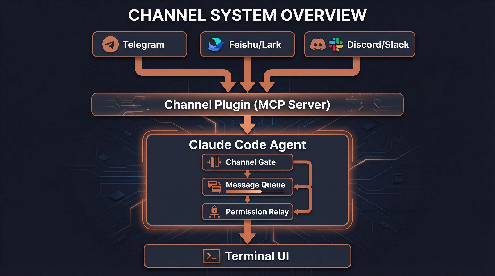
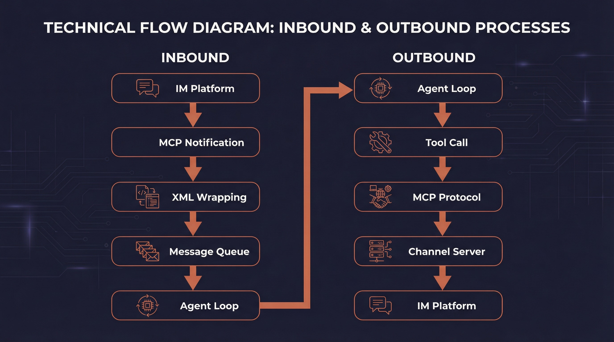
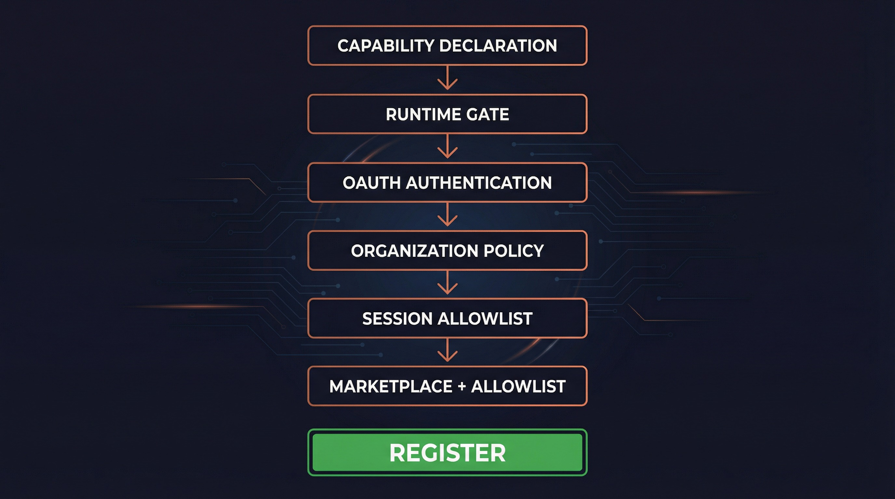
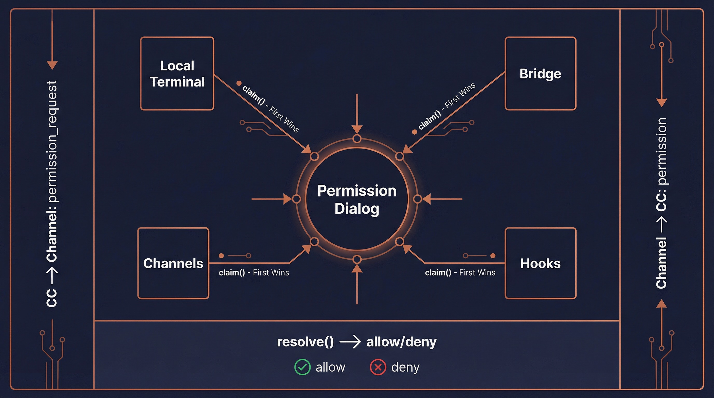

# Channel System Architecture

> A deep dive into how Claude Code enables remote Agent control via IM platforms

<p align="center">
<a href="#1-what-is-a-channel">Concepts</a> ·
<a href="#2-architecture-overview">Architecture</a> ·
<a href="#3-message-protocol">Protocol</a> ·
<a href="#4-six-layer-access-control">Access Control</a> ·
<a href="#5-permission-relay-system">Permission Relay</a> ·
<a href="#6-ui-components">UI</a> ·
<a href="#7-plugin-channel-architecture">Plugins</a> ·
<a href="#8-security-design">Security</a> ·
<a href="#9-command-line-interface">CLI</a> ·
<a href="#10-feature-flags-and-analytics">Feature Flags</a>
</p>



---

## 1. What is a Channel

A Channel is Claude Code's **IM integration system** that allows users to remotely control a running Claude Code Agent through instant messaging platforms such as Telegram, Feishu (Lark), Discord, and Slack.

### Core Idea

Traditional AI coding assistants can only interact through the terminal. The Channel system breaks this limitation — you can send messages to Claude Code from your phone via Telegram, and it will understand and execute your requests just as it would in the terminal, replying directly to your chat window.

### The Essence of a Channel

From a technical perspective, a Channel is simply a special **MCP (Model Context Protocol) Server** that must:

1. **Declare capability**: Announce `experimental['claude/channel']` during MCP handshake
2. **Push messages**: Send inbound messages via `notifications/claude/channel` notifications
3. **Expose tools**: Provide MCP tools like `reply`, `react`, `edit_message` for the Agent to respond through

```typescript
// Two forms of Channel entries
type ChannelEntry =
  | { kind: 'plugin'; name: string; marketplace: string; dev?: boolean }
  | { kind: 'server'; name: string; dev?: boolean }
```

**Plugin kind**: Verified plugins from a marketplace (e.g., `plugin:telegram@anthropic`)
**Server kind**: Directly specified MCP server names (always requires dev bypass)

---

## 2. Architecture Overview



### End-to-End Message Flow

The Channel system follows a clear bidirectional message path:

```
┌─────────────────────────────────────────────────────────────┐
│                    Inbound (IM → Agent)                      │
│                                                             │
│  Telegram/Feishu/Discord                                    │
│       ↓                                                     │
│  Channel Plugin (MCP Server)                                │
│       ↓                                                     │
│  notifications/claude/channel { content, meta }             │
│       ↓                                                     │
│  useManageMCPConnections → registerNotificationHandler      │
│       ↓                                                     │
│  wrapChannelMessage() → <channel source="..." user="...">  │
│       ↓                                                     │
│  enqueue({ priority: 'next', isMeta: true })                │
│       ↓                                                     │
│  SleepTool polls hasCommandsInQueue() every ~1s             │
│       ↓                                                     │
│  Model sees <channel> tag, understands message source       │
└─────────────────────────────────────────────────────────────┘

┌─────────────────────────────────────────────────────────────┐
│                    Outbound (Agent → IM)                     │
│                                                             │
│  Model decides which tool to use for reply                  │
│       ↓                                                     │
│  callTool() → Channel's MCP tools                           │
│  (reply / react / edit_message / download_attachment)        │
│       ↓                                                     │
│  MCP protocol calls Channel Server                          │
│       ↓                                                     │
│  Channel Server sends message to IM platform                │
│       ↓                                                     │
│  Telegram/Feishu/Discord user receives reply                │
└─────────────────────────────────────────────────────────────┘
```

### Core Component Map

| Component | File | Responsibility |
|-----------|------|---------------|
| **Channel Gate** | `channelNotification.ts` | Six-layer access control |
| **Message Wrapper** | `channelNotification.ts` | XML message wrapping |
| **Permission Relay** | `channelPermissions.ts` | Remote permission approval |
| **Allowlist** | `channelAllowlist.ts` | GrowthBook allowlist management |
| **MCP Connection** | `useManageMCPConnections.ts` | Connection mgmt & notification registration |
| **Channel Message UI** | `UserChannelMessage.tsx` | Terminal rendering of channel messages |
| **Dev Dialog** | `DevChannelsDialog.tsx` | Development mode confirmation dialog |
| **Channels Notice** | `ChannelsNotice.tsx` | Startup channel status notifications |
| **Plugin Integration** | `mcpPluginIntegration.ts` | Plugin scoped naming |
| **State** | `bootstrap/state.ts` | Global channel allowlist state |

---

## 3. Message Protocol

### 3.1 Inbound Notification Schema

The notification format Channel Servers push to Claude Code:

```typescript
// channelNotification.ts
const ChannelMessageNotificationSchema = z.object({
  method: z.literal('notifications/claude/channel'),
  params: z.object({
    content: z.string(),
    // Opaque passthrough — thread_id, user, etc.
    // Rendered as attributes on the <channel> tag
    meta: z.record(z.string(), z.string()).optional(),
  }),
})
```

### 3.2 XML Wrapping

After receiving the notification, the system wraps it in a `<channel>` XML tag:

```typescript
// channelNotification.ts:106-116
function wrapChannelMessage(
  serverName: string,
  content: string,
  meta?: Record<string, string>,
): string {
  const attrs = Object.entries(meta ?? {})
    .filter(([k]) => SAFE_META_KEY.test(k))  // Prevent XML injection
    .map(([k, v]) => ` ${k}="${escapeXmlAttr(v)}"`)
    .join('')
  return `<channel source="${escapeXmlAttr(serverName)}"${attrs}>
${content}
</channel>`
}
```

**Example output**:
```xml
<channel source="plugin:telegram:tg" user="alice" chat_id="123456">
Can you check what's wrong with main.ts?
</channel>
```

When the model sees this tag, it knows the message came from Telegram user "alice" and will use Telegram's `reply` tool to respond.

### 3.3 Safe Metadata Filtering

Meta keys become XML attribute names. A crafted key like `x="" injected="y` could break out of the attribute structure. The system uses strict regex filtering:

```typescript
// Only allow plain identifier-format key names
const SAFE_META_KEY = /^[a-zA-Z_][a-zA-Z0-9_]*$/
```

In practice, channel servers only send safe keys like `chat_id`, `user`, `thread_ts`, `message_id`.

### 3.4 Message Enqueuing

Wrapped messages are pushed into the message queue:

```typescript
enqueue({
  mode: 'prompt',
  value: wrapChannelMessage(serverName, content, meta),
  priority: 'next',        // High priority
  isMeta: true,             // Metadata message
  origin: { kind: 'channel', server: serverName },
  skipSlashCommands: true   // Don't interpret as slash commands
})
```

SleepTool polls `hasCommandsInQueue()` every ~1 second, waking the Agent when new messages arrive.

---

## 4. Six-Layer Access Control



The Channel system employs **six progressive access control layers**, each capable of independently blocking Channel registration. This is the cornerstone of the system's security.

### Gate Function Signature

```typescript
// channelNotification.ts:191-316
function gateChannelServer(
  serverName: string,
  capabilities: ServerCapabilities | undefined,
  pluginSource: string | undefined,
): ChannelGateResult  // { action: 'register' } | { action: 'skip', kind, reason }
```

### 4.1 Layer 1: Capability Declaration

```typescript
if (!capabilities?.experimental?.['claude/channel']) {
  return { action: 'skip', kind: 'capability',
    reason: 'server did not declare claude/channel capability' }
}
```

The MCP Server must declare `experimental['claude/channel']: {}` during handshake. This is MCP's "presence signal" idiom (similar to `tools: {}`), separating Channel Servers from ordinary MCP Servers.

### 4.2 Layer 2: Runtime Gate

```typescript
if (!isChannelsEnabled()) {
  return { action: 'skip', kind: 'disabled',
    reason: 'channels feature is not currently available' }
}
```

`isChannelsEnabled()` checks GrowthBook feature flag `tengu_harbor` (default false, 5-minute refresh). This is the global "emergency brake" — flipping this switch immediately disables all Channels without a release.

### 4.3 Layer 3: OAuth Authentication

```typescript
if (!getClaudeAIOAuthTokens()?.accessToken) {
  return { action: 'skip', kind: 'auth',
    reason: 'channels requires claude.ai authentication (run /login)' }
}
```

Channels are restricted to OAuth-authenticated users. API key users are blocked because Console doesn't have a `channelsEnabled` admin surface yet.

### 4.4 Layer 4: Organization Policy

```typescript
const sub = getSubscriptionType()
const managed = sub === 'team' || sub === 'enterprise'
const policy = managed ? getSettingsForSource('policySettings') : undefined
if (managed && policy?.channelsEnabled !== true) {
  return { action: 'skip', kind: 'policy',
    reason: 'channels not enabled by org policy' }
}
```

Teams/Enterprise organizations must explicitly enable `channelsEnabled: true` in managed settings. Default is OFF — even a team org with zero configured policy keys is still considered managed and does not fall through to the unmanaged path.

### 4.5 Layer 5: Session Allowlist

```typescript
const entry = findChannelEntry(serverName, getAllowedChannels())
if (!entry) {
  return { action: 'skip', kind: 'session',
    reason: `server ${serverName} not in --channels list for this session` }
}
```

The MCP Server must be in the current session's `--channels` parameter list. Even if a trusted server dynamically adds the `claude/channel` capability, it cannot bypass this — the user must explicitly list it at startup.

### 4.6 Layer 6: Marketplace Verification + Allowlist

For plugin-kind channels:

```typescript
// Marketplace verification: ensure installed plugin matches claimed source
const actual = pluginSource
  ? parsePluginIdentifier(pluginSource).marketplace
  : undefined
if (actual !== entry.marketplace) {
  return { action: 'skip', kind: 'marketplace',
    reason: `tag mismatch: asked for @${entry.marketplace}, installed from ${actual}` }
}

// Allowlist check: plugin must be on GrowthBook approved list
if (!entry.dev) {
  const { entries } = getEffectiveChannelAllowlist(sub, policy?.allowedChannelPlugins)
  if (!entries.some(e => e.plugin === entry.name && e.marketplace === entry.marketplace)) {
    return { action: 'skip', kind: 'allowlist', reason: 'not on approved list' }
  }
}
```

**Dual verification**: First verify that the `@anthropic` tag in `--channels plugin:slack@anthropic` matches the actual installed plugin source (preventing `slack@evil` from impersonating `slack@anthropic`), then check against the approved allowlist.

**Allowlist source priority**: Team/Enterprise orgs can set `allowedChannelPlugins`, which replaces the GrowthBook ledger allowlist (admin owns the trust decision).

For server-kind entries, the allowlist always fails (schema is `{marketplace, plugin}` format, server kind cannot match), unless `--dangerously-load-development-channels` is used (setting `entry.dev = true` to bypass).

### Gate Result Type

```typescript
type ChannelGateResult =
  | { action: 'register' }           // Passed all checks, register notification handler
  | { action: 'skip'; kind: string; reason: string }  // Blocked at some layer

// kind enum: capability | disabled | auth | policy | session | marketplace | allowlist
```

---

## 5. Permission Relay System



### 5.1 Why Permission Relay Exists

When Claude Code needs to execute sensitive operations (like running a Bash command), it shows a permission confirmation dialog. But if the user is controlling the Agent remotely via Telegram, they can't see the local terminal dialog.

The permission relay system solves this: **forward permission prompts to the IM platform so users can approve or deny operations from their phone**.

### 5.2 Outbound: CC → Channel (Permission Request)

When the Agent triggers a permission dialog and a Channel has declared `experimental['claude/channel/permission']` capability:

```typescript
// Notification schema
const CHANNEL_PERMISSION_REQUEST_METHOD =
  'notifications/claude/channel/permission_request'

type ChannelPermissionRequestParams = {
  request_id: string      // 5-letter identifier (e.g., "tbxkq")
  tool_name: string       // Tool name (e.g., "Bash")
  description: string     // Human-readable description
  input_preview: string   // JSON input preview, truncated to 200 chars
}
```

The Channel Server formats this for its platform (Telegram markdown, Discord embed, etc.) and sends it to the user.

### 5.3 Short Request ID Generation

The 5-letter identifier design is thoughtfully crafted:

```typescript
// channelPermissions.ts:140-152
function shortRequestId(toolUseID: string): string {
  let candidate = hashToId(toolUseID)
  for (let salt = 0; salt < 10; salt++) {
    if (!ID_AVOID_SUBSTRINGS.some(bad => candidate.includes(bad))) {
      return candidate
    }
    candidate = hashToId(`${toolUseID}:${salt}`)
  }
  return candidate
}
```

**Design decisions**:
- **25-letter alphabet**: a-z minus `l` (confusion with 1/I), 25^5 ≈ 9.8M combinations
- **FNV-1a hash**: Not cryptographic, but stable and fast
- **Profanity filter**: 5 random letters can spell offensive words (imagine texting your boss), built-in blocklist
- **Letters only**: Phone users don't need to switch keyboard modes (hex alternates between letters and digits)
- **Case insensitive**: Accommodates phone autocorrect

### 5.4 Inbound: Channel → CC (Permission Response)

Users reply in IM with format: `yes tbxkq` or `no tbxkq`

```typescript
// Server-side parsing regex
const PERMISSION_REPLY_RE = /^\s*(y|yes|n|no)\s+([a-km-z]{5})\s*$/i

// Structured notification (server parses and emits, CC doesn't regex-match text)
const ChannelPermissionNotificationSchema = z.object({
  method: z.literal('notifications/claude/channel/permission'),
  params: z.object({
    request_id: z.string(),
    behavior: z.enum(['allow', 'deny']),
  }),
})
```

**Key design**: The Channel Server is responsible for parsing the user's reply and emitting a structured event — CC never does text regex matching. This means casual conversation text can never accidentally trigger permission approval.

### 5.5 Multi-Source Racing

Permission responses come from four sources, first to resolve wins:

```
┌──────────────┐   ┌──────────────┐   ┌──────────────┐   ┌──────────────┐
│  Local UI    │   │    Bridge    │   │   Channels   │   │    Hooks     │
│  Terminal    │   │   Remote     │   │ Telegram etc │   │  Permission  │
└──────┬───────┘   └──────┬───────┘   └──────┬───────┘   └──────┬───────┘
       │                   │                   │                  │
       └───────────────────┴───────────────────┴──────────────────┘
                                    │
                              claim() — first to resolve wins
                                    │
                              ┌─────┴─────┐
                              │  resolve   │
                              │ allow/deny │
                              └───────────┘
```

`createChannelPermissionCallbacks()` uses a closure to maintain a pending Map (not at module level, not in AppState — function references in state cause serialization issues), constructed once and stored in AppState.

### 5.6 Filtering Permission Relay Clients

```typescript
// channelPermissions.ts:177-194
function filterPermissionRelayClients(clients, isInAllowlist) {
  return clients.filter(c =>
    c.type === 'connected' &&
    isInAllowlist(c.name) &&
    c.capabilities?.experimental?.['claude/channel'] !== undefined &&
    c.capabilities?.experimental?.['claude/channel/permission'] !== undefined
  )
}
```

**All three conditions required**: connected + in allowlist + declares BOTH capabilities (`claude/channel` AND `claude/channel/permission`). The second capability is explicit opt-in — a relay-only Channel never accidentally becomes a permission approval surface.

---

## 6. UI Components

### 6.1 Terminal Message Rendering (UserChannelMessage)

```typescript
// UserChannelMessage.tsx
// Parses <channel> XML tags and renders them in terminal

const CHANNEL_RE = new RegExp(
  `<${CHANNEL_TAG}\\s+source="([^"]+)"([^>]*)>\\n?([\\s\\S]*?)\\n?</${CHANNEL_TAG}>`
)

// Plugin server name display: plugin:slack-channel:slack → slack
function displayServerName(name: string): string {
  const i = name.lastIndexOf(':')
  return i === -1 ? name : name.slice(i + 1)
}

const TRUNCATE_AT = 60  // Message body truncation length
```

**Rendered output**:
```
◁ tg · alice: Can you check what's wrong with main.ts?
```

Where `◁` is the Channel arrow symbol (`CHANNEL_ARROW`), showing the server leaf name and optional username.

### 6.2 Status Notice (ChannelsNotice)

Shows the status of `--channels` entries at startup, reporting blockers:

| Block Type | Meaning |
|------------|---------|
| `disabled` | Channel feature not enabled (tengu_harbor off) |
| `noAuth` | Not OAuth authenticated |
| `policyBlocked` | Org policy hasn't enabled channels |
| `unmatched` | Not matched in `--channels` list |

### 6.3 Developer Confirmation Dialog (DevChannelsDialog)

Warning dialog shown when using `--dangerously-load-development-channels`:

```
┌─ WARNING: Loading development channels ──────────────────┐
│                                                          │
│  --dangerously-load-development-channels is for local    │
│  channel development only. Do not use this option to     │
│  run channels you have downloaded off the internet.      │
│                                                          │
│  Please use --channels to run a list of approved channels│
│                                                          │
│  Channels: plugin:my-channel@local                       │
│                                                          │
│  > I am using this for local development                 │
│    Exit                                                  │
└──────────────────────────────────────────────────────────┘
```

Selecting "Exit" calls `gracefulShutdownSync(1)` for immediate exit.

---

## 7. Plugin Channel Architecture

### 7.1 Channel Declaration in Plugin Manifest

Plugins declare channels via the `channels` array in `plugin.json`:

```typescript
// schemas.ts:670-703
const PluginManifestChannelsSchema = z.object({
  channels: z.array(z.object({
    server: z.string().min(1),       // MCP server name, must match key in mcpServers
    displayName: z.string().optional(),  // Config dialog title (e.g., "Telegram")
    userConfig: z.record(             // Fields to prompt user for at install time
      z.string(),
      PluginUserConfigOptionSchema()
    ).optional(),
  }).strict()),
})
```

**Example plugin.json**:
```json
{
  "name": "telegram",
  "version": "1.0.0",
  "mcpServers": {
    "tg": {
      "command": "node",
      "args": ["./server.js"],
      "env": {
        "BOT_TOKEN": "${user_config.bot_token}",
        "OWNER_ID": "${user_config.owner_id}"
      }
    }
  },
  "channels": [
    {
      "server": "tg",
      "displayName": "Telegram",
      "userConfig": {
        "bot_token": {
          "type": "string",
          "description": "Telegram Bot API Token",
          "required": true,
          "secret": true
        },
        "owner_id": {
          "type": "string",
          "description": "Your Telegram User ID",
          "required": true
        }
      }
    }
  ]
}
```

### 7.2 Configuration Flow (PluginOptionsFlow)

After enabling a plugin, if a Channel has unconfigured `userConfig` fields:

1. `getUnconfiguredChannels()` detects fields that haven't passed validation
2. `PluginOptionsFlow` component prompts the user for each field
3. Sensitive values (like bot_token) stored in Keychain
4. Regular values stored in `~/.claude/plugins/options/{pluginId}.json`

```typescript
// mcpPluginIntegration.ts:290-318
function getUnconfiguredChannels(plugin: LoadedPlugin): UnconfiguredChannel[] {
  const channels = plugin.manifest.channels
  if (!channels || channels.length === 0) return []

  const unconfigured: UnconfiguredChannel[] = []
  for (const channel of channels) {
    if (!channel.userConfig) continue
    const saved = loadMcpServerUserConfig(pluginId, channel.server) ?? {}
    const validation = validateUserConfig(saved, channel.userConfig)
    if (!validation.valid) {
      unconfigured.push({
        server: channel.server,
        displayName: channel.displayName ?? channel.server,
        configSchema: channel.userConfig,
      })
    }
  }
  return unconfigured
}
```

### 7.3 Scoped Naming

Plugin-provided MCP Servers get a scope prefix to avoid naming conflicts:

```typescript
// mcpPluginIntegration.ts:341-360
function addPluginScopeToServers(
  servers: Record<string, McpServerConfig>,
  pluginName: string,
  pluginSource: string,  // e.g., "telegram@anthropic"
): Record<string, ScopedMcpServerConfig> {
  const scopedServers = {}
  for (const [name, config] of Object.entries(servers)) {
    const scopedName = `plugin:${pluginName}:${name}`
    scopedServers[scopedName] = {
      ...config,
      scope: 'dynamic',
      pluginSource,
    }
  }
  return scopedServers
}
```

**Naming transformation**:
- Input: `{ "tg": { ... } }` from `telegram@anthropic`
- Output: `{ "plugin:telegram:tg": { scope: 'dynamic', pluginSource: 'telegram@anthropic', ... } }`

`pluginSource` is preserved on the config for later marketplace verification in the Channel Gate.

### 7.4 Effective Allowlist Source

```typescript
// channelNotification.ts:127-138
function getEffectiveChannelAllowlist(sub, orgList) {
  // Team/Enterprise custom allowlist → replaces GrowthBook ledger
  if ((sub === 'team' || sub === 'enterprise') && orgList) {
    return { entries: orgList, source: 'org' }
  }
  // Default to GrowthBook ledger
  return { entries: getChannelAllowlist(), source: 'ledger' }
}
```

Organization admins can fully control which Channel plugins are trusted via `allowedChannelPlugins`, independent of the global ledger.

---

## 8. Security Design

### 8.1 XML Injection Prevention

Channel message metadata becomes XML attributes. Two lines of defense:

1. **Key name filtering**: `SAFE_META_KEY = /^[a-zA-Z_][a-zA-Z0-9_]*$/` — only plain identifiers
2. **Value escaping**: `escapeXmlAttr()` applies XML escaping to attribute values

### 8.2 Marketplace Verification

`--channels plugin:slack@anthropic` is merely the user's "intent declaration." The runtime name `plugin:slack:X` could come from `slack@anthropic` or `slack@evil`. The gate verifies they must match:

```typescript
const actual = pluginSource
  ? parsePluginIdentifier(pluginSource).marketplace
  : undefined
if (actual !== entry.marketplace) {
  return { action: 'skip', kind: 'marketplace', reason: '...' }
}
```

### 8.3 Trust Boundary of Permission Relay

From Kenneth's analysis in code comments (PR discussion #2956440848):

> "Would this let Claude self-approve?" Answer: the approving party is the human via the channel, not Claude. But the trust boundary isn't the terminal — it's the allowlist (tengu_harbor_ledger). A compromised channel server CAN fabricate "yes \<id\>" without the human seeing the prompt. Accepted risk: a compromised channel already has unlimited conversation-injection turns (social-engineer over time, wait for acceptEdits, etc.); inject-then-self-approve is faster, not more capable. The dialog slows a compromised channel; it doesn't stop one.

### 8.4 skipSlashCommands

Channel messages are enqueued with `skipSlashCommands: true`, ensuring text like `/help` sent by IM users is not interpreted as Claude Code slash commands.

### 8.5 Dev Bypass Granularity

The `dev` flag from `--dangerously-load-development-channels` is **per-entry**, not global. After accepting the dev dialog, only explicitly dev-flagged entries bypass the allowlist — normal `--channels` entries still go through full allowlist verification.

---

## 9. Command-Line Interface

### 9.1 Startup Parameters

```bash
# Use approved Channel plugins
claude --channels plugin:telegram@anthropic plugin:feishu@anthropic

# Local development mode (bypass allowlist)
claude --dangerously-load-development-channels plugin:my-channel@local

# Both can be used simultaneously
claude --channels plugin:telegram@anthropic \
       --dangerously-load-development-channels plugin:dev-channel@local
```

### 9.2 Argument Parsing

```typescript
// main.tsx
const parseChannelEntries = (raw: string[], flag: string): ChannelEntry[] => {
  // Parse "plugin:slack@anthropic", "server:slack", etc.
  // Validate format correctness
  // Return ChannelEntry array
}

// Store in global state
setAllowedChannels(channelEntries)
```

### 9.3 Feature Gating

These CLI options are only available when feature flags are enabled:

```typescript
// main.tsx:3850-3852
if (feature('KAIROS') || feature('KAIROS_CHANNELS')) {
  program.addOption(new Option('--channels <servers...>', '...').hideHelp())
  program.addOption(new Option('--dangerously-load-development-channels <servers...>', '...').hideHelp())
}
```

`hideHelp()` means these options don't appear in `--help` output — the Channel feature is currently in hidden feature stage.

---

## 10. Feature Flags and Analytics

### 10.1 Feature Flags

| Flag | Source | Purpose |
|------|--------|---------|
| `KAIROS` / `KAIROS_CHANNELS` | Build-time | Controls CLI argument registration and code paths |
| `tengu_harbor` | GrowthBook runtime | Channel system master switch (default false) |
| `tengu_harbor_ledger` | GrowthBook runtime | Approved plugin allowlist |
| `tengu_harbor_permissions` | GrowthBook runtime | Permission relay feature switch |

### 10.2 Analytics Events

```typescript
// Channel Gate result
tengu_mcp_channel_gate: {
  gate_kind: 'disabled' | 'auth' | 'policy' | 'session' | 'marketplace' | 'allowlist'
  plugin: string
  is_dev: boolean
}

// Channel message
tengu_mcp_channel_message: {
  content_length: number
  meta_key_count: number
  entry_kind: 'plugin' | 'server'
  is_dev: boolean
  plugin: string
}

// Startup flags
tengu_mcp_channel_flags: {
  channels_count: number
  dev_count: number
  plugins: string[]
  dev_plugins: string[]
}
```

---

## 11. Summary

The Channel system is Claude Code's **IM integration framework**, and its design embodies several core principles:

### 1. Security First

Six access control layers ensure only approved, user-explicitly-chosen Channels can push messages. From build-time feature flags to runtime allowlists, each layer can independently interrupt the flow.

### 2. Protocol-Driven

Channels aren't special code — they're ordinary MCP Servers with an additional notification protocol. This means any language that can implement MCP can write Channel plugins.

### 3. Loose Coupling

Channel failures don't block local workflows. Permission relay is a multi-source racing mechanism where any source's response is valid.

### 4. Progressive Trust

From global switch → authentication → org policy → session allowlist → marketplace verification → allowlist, trust levels increase progressively, with each step serving a clear security purpose.

### 5. Plugin-Friendly

Through declarative Channel configuration in `plugin.json`, automatic user config prompting, and scoped naming, third-party developers can easily build their own Channel plugins.

### Source File Index

| File | Lines | Responsibility |
|------|-------|---------------|
| `src/services/mcp/channelNotification.ts` | ~320 | Gating, message wrapping, allowlist integration |
| `src/services/mcp/channelPermissions.ts` | ~240 | Permission relay, request ID generation |
| `src/services/mcp/channelAllowlist.ts` | ~80 | GrowthBook allowlist queries |
| `src/services/mcp/useManageMCPConnections.ts` | — | Connection management, notification handler registration |
| `src/components/messages/UserChannelMessage.tsx` | ~140 | Terminal rendering of Channel messages |
| `src/components/DevChannelsDialog.tsx` | ~105 | Development mode confirmation dialog |
| `src/components/LogoV2/ChannelsNotice.tsx` | — | Startup status notifications |
| `src/utils/plugins/mcpPluginIntegration.ts` | — | Plugin MCP integration, scoped naming |
| `src/utils/plugins/schemas.ts` | ~700 | Plugin manifest schema (incl. Channel declarations) |
| `src/bootstrap/state.ts` | — | Global Channel allowlist state |
| `src/main.tsx` | ~3850 | CLI argument registration and parsing |
